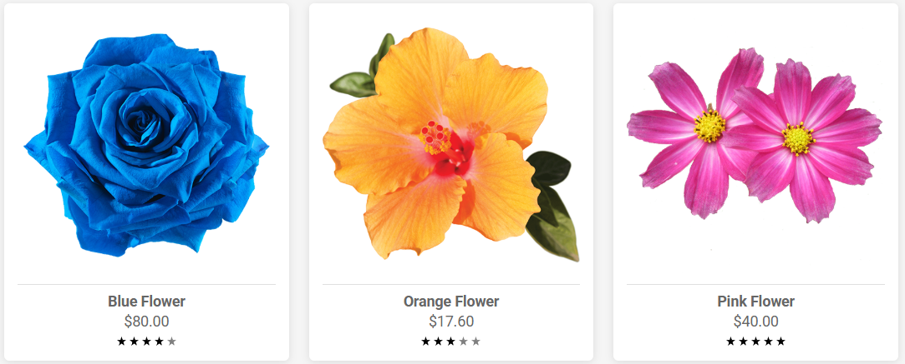
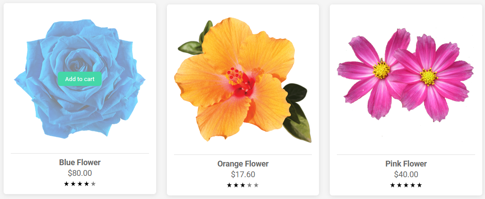
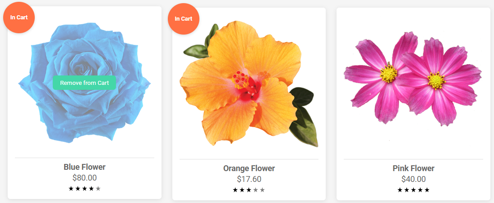

# Vention Front-End Assignment

This project displays a set of interactive flower cards using only **HTML**, **SCSS**, and **Vanilla JavaScript**. It adheres to all the assignment constraints and showcases hover effects, cart interactivity, and responsive design.

## Features
- Responsive layout using CSS Grid
- Fade-in image overlay with Add/Remove button
- Cart interaction with visual badge
- SVG-based star rating (supports half-stars)

## Screenshots
### Default View - Shows all flower cards on initial load.


### Hover State - Displays the 'Add to Cart' button on image fade.


### In Cart State - Shows cart badge and 'Remove from Cart' button.


## Getting Started
To run this project locally:
1. Clone or download the repository.
2. Open `index.html` in a browser.

## Project Structure
```
├── assets/         # Static images and icons used in the app
├── screenshots/    # Static images used for README.md
├── scripts
│   └── cards.js
│   └── main.js
├── style
│   └── _variables.scss
│   └── main.css
│   └── main.css.map
│   └── main.scss
├── style
├── index.html
```

## Notes
- No frameworks were used (per assignment requirements).
- Card data is stored directly in JavaScript, simulating a mocked API response.
